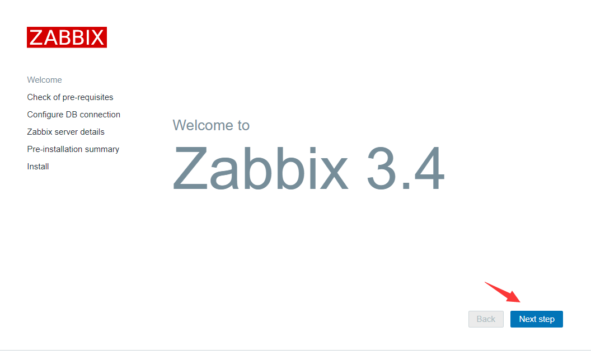
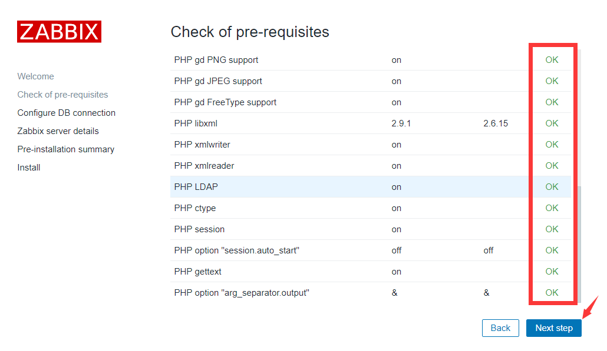
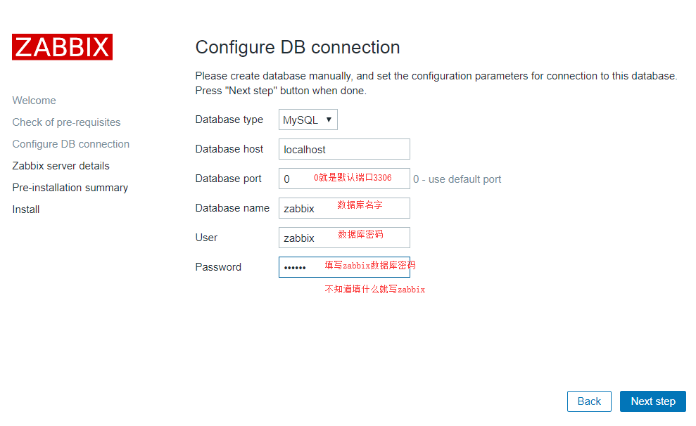
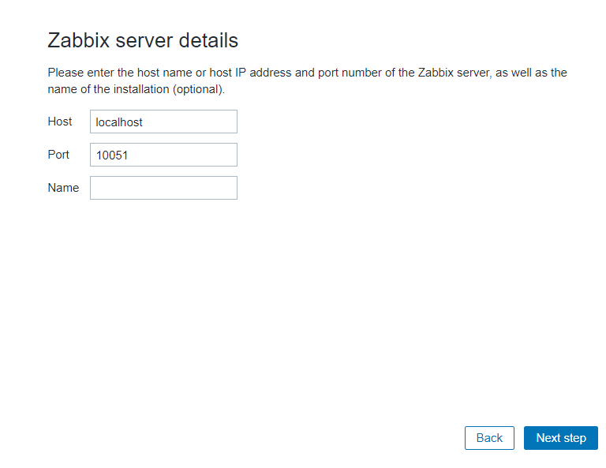
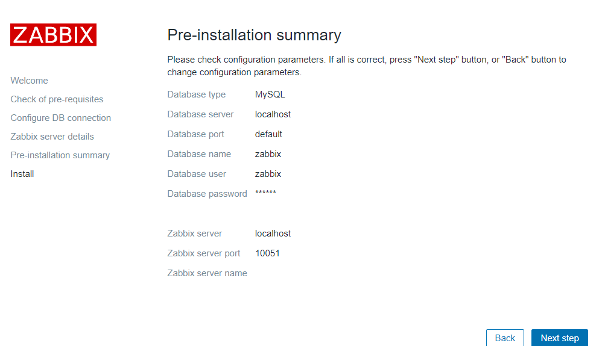
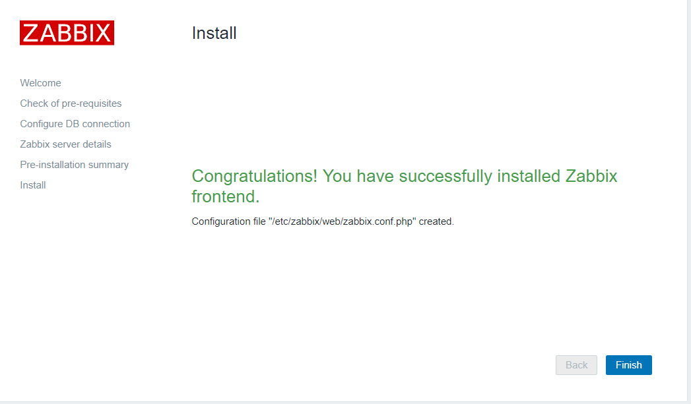
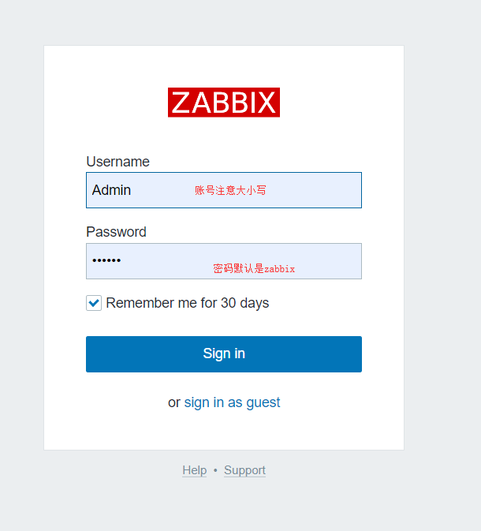
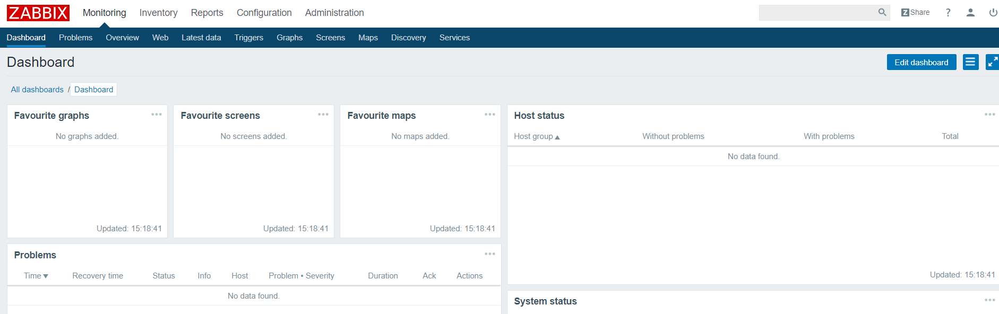
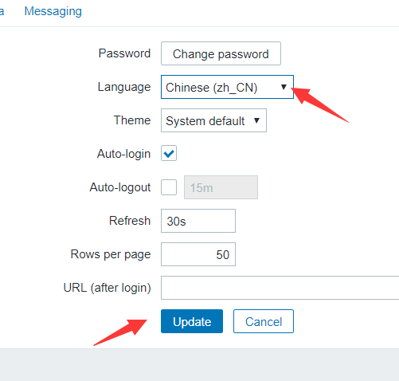
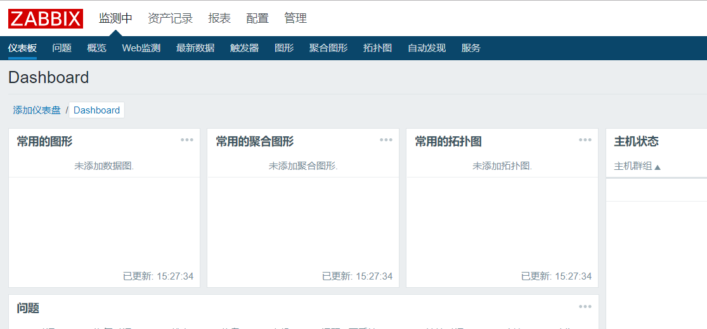

### 1 一步一步部署

#### 1.1 安装zabbix仓库源

这里安装阿里的zabbix仓库地址
选用zabbix版本3.4
```
rpm -Uvh https://mirrors.aliyun.com/zabbix/zabbix/3.4/rhel/7/x86_64/zabbix-release-3.4-2.el7.noarch.rpm
yum clean all 
yum makecache
yum install -y zabbix-server-mysql zabbix-web-mysql zabbix-get mariadb-server
```

#### 1.2 配置数据库

```
systemctl start mariadb.service
mysql <<EOF
create database zabbix character set utf8 collate utf8_bin;
grant all privileges on zabbix.* to zabbix@localhost identified by "zabbix";
flush privileges;
EOF
#导入zabbix数据库
zcat /usr/share/doc/zabbix-server-mysql-3.4.15/create.sql.gz|mysql -uzabbix -pzabbix zabbix

```

#### 1.3 修改zabbix-server配置文件

```
cp /etc/zabbix/zabbix_server.conf{,.bak}
echo "LogFile=/var/log/zabbix/zabbix_server.log
LogFileSize=0
PidFile=/var/run/zabbix/zabbix_server.pid
DBName=zabbix
DBUser=zabbix
DBPassword=zabbix
SNMPTrapperFile=/var/log/snmptrap/snmptrap.log
Timeout=4
AlertScriptsPath=/usr/lib/zabbix/alertscripts
ExternalScripts=/usr/lib/zabbix/externalscripts
LogSlowQueries=3000" >/etc/zabbix/zabbix_server.conf

```

#### 1.4 配置时区及zabbix中文字体

```
###  修改时区为香港
sed -i '18a\        php_value date.timezone  Asia/Shanghai' /etc/httpd/conf.d/zabbix.conf
##   解决中文乱码
yum -y install wqy-microhei-fonts
\cp /usr/share/fonts/wqy-microhei/wqy-microhei.ttc /usr/share/fonts/dejavu/DejaVuSans.ttf
```

#### 1.5 启动zabbix

#启动并开机自启动
systemctl start zabbix-server
systemctl start httpd

systemctl enable mariadb
systemctl enable zabbix-server
systemctl enable httpd

### 2 脚本快速安装

```
#!/bin/bash
# install zabbix-server 
# version 1.1
# author  wangzhen
# date    20190514


OsVersion=`cat /etc/redhat-release|awk -F "." '{print $1}'|grep -o [0-9]`
DbPswd=zabbix
ServerConfFile=/etc/zabbix/zabbix_server.conf
ZabbixRepoUrl6=https://mirrors.aliyun.com/zabbix/zabbix/3.4/rhel/6/x86_64/zabbix-release-3.4-1.el6.noarch.rpm
ZabbixRepoUrl7=https://mirrors.aliyun.com/zabbix/zabbix/3.4/rhel/7/x86_64/zabbix-release-3.4-2.el7.noarch.rpm
LogFile=$0.log


ConfFile() {
echo "LogFile=/var/log/zabbix/zabbix_server.log
LogFileSize=0
PidFile=/var/run/zabbix/zabbix_server.pid
DBName=zabbix
DBUser=zabbix
DBPassword=$DbPswd
SNMPTrapperFile=/var/log/snmptrap/snmptrap.log
Timeout=4
AlertScriptsPath=/usr/lib/zabbix/alertscripts
ExternalScripts=/usr/lib/zabbix/externalscripts
LogSlowQueries=3000" >$ServerConfFile
}


CheckInstall() {
##检查端口占用
[ `lsof -i:10051|wc -l` -ne 0 ] && echo 'prot 10051 already in use .' && exit 1
##检查是否已安装
[`rpm -qa |grep zabbix-server|wc -l` -gt 1 ] && echo 'zabbix server already installed' && exit 1

}


ZabbixServerInstall() {
ZabbixRepoRpm=`echo $ZabbixRepoUrl | awk -F '/' '{print $NF}'`

#安装zabbix源、aliyun YUM源、zabbix-server、mariadb
curl -o /etc/yum.repos.d/CentOS-Base.repo http://mirrors.aliyun.com/repo/Centos-${OsVersion}.repo
curl -o /etc/yum.repos.d/epel.repo http://mirrors.aliyun.com/repo/epel-${OsVersion}.repo
wget $ZabbixRepoUrl 
yum localinstall -y $ZabbixRepoRpm
yum clean all 
yum makecache
yum install -y zabbix-server-mysql zabbix-web-mysql zabbix-get mariadb-server
}


MysqlConfigure() {
systemctl start mariadb.service
mysql <<EOF
create database zabbix character set utf8 collate utf8_bin;
grant all privileges on zabbix.* to zabbix@localhost identified by "$DbPswd";
flush privileges;
EOF
#导入zabbix数据库
ZabbixVersion=`rpm -qa|grep zabbix-server|awk -F '-' '{print $4}'`
zcat /usr/share/doc/zabbix-server-mysql-${ZabbixVersion}/create.sql.gz|mysql -uzabbix -p"$DbPswd" zabbix
}


ZabbixConfigure() {
cp $ServerConfFile{,.bak}
##配置文件修改
ConfFile
#添加时区
sed -i '18a\        php_value date.timezone  Asia/Shanghai' /etc/httpd/conf.d/zabbix.conf
#解决中文乱码
yum -y install wqy-microhei-fonts
\cp /usr/share/fonts/wqy-microhei/wqy-microhei.ttc /usr/share/fonts/dejavu/DejaVuSans.ttf
}


Start() {
systemctl start zabbix-server
systemctl start httpd

systemctl enable mariadb
systemctl enable zabbix-server
systemctl enable httpd
}

Check() {
#输出信息
echo "浏览器访问 http://`hostname -I|awk '{print $1}'`/zabbix"
}

#设置解析 注意：网络条件较好时，可以不用自建yum源
# echo '10.0.0.1 mirrors.aliyuncs.com mirrors.aliyun.com repo.zabbix.com' >> /etc/hosts

main() {
case "$OsVersion" in
  6)
    ZabbixRepoUrl=$ZabbixRepoUrl6
    CheckInstall
    ZabbixServerInstall
    MysqlConfigure
    ZabbixConfigure
    Start
    Check
    ;;
  7)
    ZabbixRepoUrl=$ZabbixRepoUrl7
    CheckInstall
    ZabbixServerInstall
    MysqlConfigure
    ZabbixConfigure
    Start
    Check
    ;;
  *)
    echo 'OsVersion must be 6 or 7' >>$log
    exit 1
esac
}


main

```

### 3 zabbix web界面配置

#### 3.1 web界面安装配置
http://ip/zabbix
下一步


全部参数都ok，如果不OK，需要调整php参数


填写数据库参数


直接下一步


下一步


安装完成


刷新登录

登录成功


#### 3.2 修改语言为中文
右上角

选择语言为中文，

点击更新



